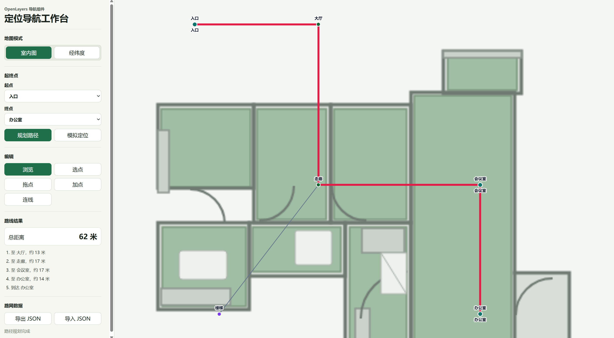

# ol-location-navigation

OpenLayers 定位导航组件，支持经纬度地图和室内图片地图两种模式。

## Demo

GitHub Pages:

https://glzcc.github.io/ol-location-navigation/



## 第一版能力

- JSON 路网导入导出：节点、边、楼层、POI。
- 最短路径规划：Dijkstra，支持权重、禁行边、单向边。
- 导航提示：根据路线生成分段距离和到达提示。
- OpenLayers 渲染：底图、路网、POI、路径、当前位置。
- 基础编辑：添加节点、连接节点、拖动节点。
- Vue、React、Vanilla 适配器。

## 开发

```bash
npm install
npm run dev
```

## 安装

```bash
npm install @gl-zcc/ol-location-navigation ol
```

如果在 Vue 或 React 项目中使用，请同时安装对应框架依赖。

```bash
npm install vue
# 或
npm install react react-dom
```

## 快速开始

组件需要三类数据：

- `mapConfig`：地图配置，决定使用室内图片地图还是经纬度地图。
- `network`：可通行路网，由节点 `nodes` 和边 `edges` 组成。
- `pois`：兴趣点列表，用来让用户选择“入口、办公室、会议室”等业务点位。

### 1. 引入样式和核心类

```ts
import {
  OlLocationNavigationCore,
  type NavigationMapConfig,
  type NavigationNetwork,
  type NavPoi
} from '@gl-zcc/ol-location-navigation';
import '@gl-zcc/ol-location-navigation/style.css';
```

页面上准备一个容器：

```html
<div id="map" style="width: 100%; height: 600px"></div>
```

### 2. 准备地图配置

室内图片地图：

```ts
const mapConfig: NavigationMapConfig = {
  mode: 'image',
  image: {
    url: '/floor-plan.svg',
    width: 451,
    height: 451,
    metersPerPixel: 0.12
  },
  center: [225, 225],
  zoom: 2
};
```

经纬度地图：

```ts
const mapConfig: NavigationMapConfig = {
  mode: 'geo',
  center: [116.399, 39.91],
  zoom: 16
};
```

### 3. 准备路网数据

`nodes` 是可通行节点，`edges` 是节点之间能走的路线。路径规划只会沿着 `edges` 计算，不会穿墙直线走。

```ts
const network: NavigationNetwork = {
  floors: [{ id: 'F1', name: '一层' }],
  nodes: [
    { id: 'entrance', coord: [72, 386], floorId: 'F1', label: '入口', type: 'entrance' },
    { id: 'hall', coord: [183, 386], floorId: 'F1', label: '大厅' },
    { id: 'corridor', coord: [183, 242], floorId: 'F1', label: '走廊' },
    { id: 'office', coord: [328, 126], floorId: 'F1', label: '办公室', type: 'poi' }
  ],
  edges: [
    { id: 'e1', from: 'entrance', to: 'hall', bidirectional: true, type: 'walk' },
    { id: 'e2', from: 'hall', to: 'corridor', bidirectional: true, type: 'walk' },
    { id: 'e3', from: 'corridor', to: 'office', bidirectional: true, type: 'walk' }
  ]
};
```

常用字段说明：

- `coord`：坐标。`image` 模式下是图片像素坐标，`geo` 模式下是 `[经度, 纬度]`。
- `floorId`：楼层 ID，室内多楼层时使用。
- `weight`：边权重，可不填；不填时组件按节点距离计算。
- `bidirectional`：是否双向通行，默认按双向处理；设置为 `false` 表示只能从 `from` 走到 `to`。
- `disabled`：禁用节点或边，路径规划会绕开它。

### 4. 准备 POI

POI 可以绑定到路网节点。用户选择 POI 作为起点或终点时，组件会用它关联的 `nodeId` 来规划路径。

```ts
const pois: NavPoi[] = [
  { id: 'poi-entrance', name: '入口', coord: [72, 386], floorId: 'F1', nodeId: 'entrance' },
  { id: 'poi-office', name: '办公室', coord: [328, 126], floorId: 'F1', nodeId: 'office' }
];
```

### 5. 初始化并规划路径

```ts
const container = document.querySelector<HTMLElement>('#map');

if (!container) {
  throw new Error('找不到地图容器');
}

const navigation = new OlLocationNavigationCore(container, {
  mapConfig,
  network,
  pois
});

navigation.setStart({ type: 'poi', id: 'poi-entrance' });
navigation.setEnd({ type: 'poi', id: 'poi-office' });
const route = navigation.planRoute();

console.log(route.distance);
console.log(route.instructions);
navigation.fitToRoute();
```

`planRoute()` 返回：

```ts
{
  nodeIds: ['entrance', 'hall', 'corridor', 'office'],
  edgeIds: ['e1', 'e2', 'e3'],
  distance: 62,
  instructions: [
    { text: '至 大厅，约 13 米' },
    { text: '至 走廊，约 17 米' },
    { text: '到达 办公室' }
  ]
}
```

## 常用操作

### 监听事件

```ts
navigation.on('routeplanned', route => {
  console.log('路线规划完成', route);
});

navigation.on('routeerror', error => {
  console.error('路线规划失败', error.message);
});

navigation.on('networkchange', nextNetwork => {
  console.log('路网已编辑', nextNetwork);
});
```

### 更新当前位置

```ts
navigation.updatePosition({
  coord: [72, 386],
  floorId: 'F1',
  source: 'simulated'
});
```

### 开启路网编辑

```ts
navigation.setMode('edit-node');   // 点击地图添加节点
navigation.setMode('edit-edge');   // 依次点击两个节点创建连线
navigation.setMode('edit-select'); // 拖动已有节点
```

导出编辑后的路网：

```ts
const nextNetwork = navigation.exportNetwork();
```

## Vue 用法

```vue
<template>
  <OlLocationNavigation
    class="map"
    :map-config="mapConfig"
    :network="network"
    :pois="pois"
    mode="browse"
    @ready="navigation = $event"
    @routeplanned="route = $event"
  />
</template>

<script setup lang="ts">
import { ref } from 'vue';
import {
  OlLocationNavigationVue as OlLocationNavigation,
  type OlLocationNavigationCore
} from '@gl-zcc/ol-location-navigation';
import '@gl-zcc/ol-location-navigation/style.css';

const navigation = ref<OlLocationNavigationCore | null>(null);
const route = ref(null);

// 这里传入前文示例里的 mapConfig、network、pois。
</script>

<style>
.map {
  width: 100%;
  height: 600px;
}
</style>
```

## React 用法

```tsx
import {
  OlLocationNavigationReact,
  type RouteResult
} from '@gl-zcc/ol-location-navigation';
import '@gl-zcc/ol-location-navigation/style.css';

export function NavigationDemo() {
  function handleRoute(route: RouteResult) {
    console.log(route);
  }

  return (
    <OlLocationNavigationReact
      mapConfig={mapConfig}
      network={network}
      pois={pois}
      mode="browse"
      onRoutePlanned={handleRoute}
    />
  );
}
```
